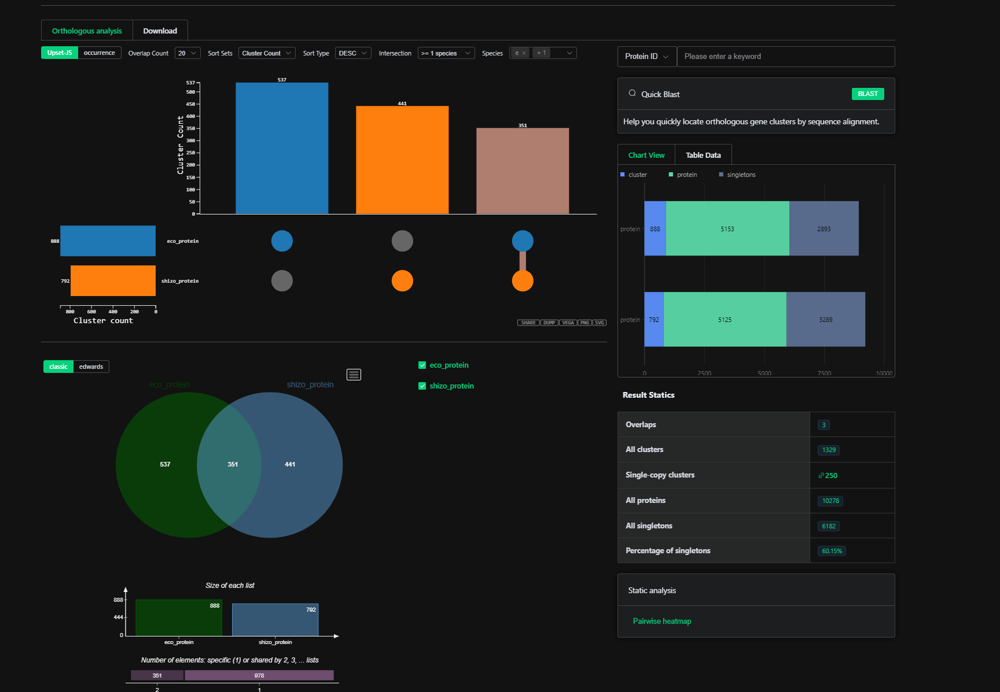

# Bioinformatics Final Project

This project aims to modernize the pipeline described in the paper ["High-throughput transcriptome sequencing and comparative analysis of Escherichia coli and Schizosaccharomyces pombe in respiratory and fermentative growth by Vichi J et al."](https://www.ncbi.nlm.nih.gov/pmc/articles/PMC7968713/) with current SOTA methods.

The paper tries to understand the differences in gene expression and metabolic responses of two distinct organisms, Escherichia coli (a bacterium) and Schizosaccharomyces pombe (a yeast), under conditions of respiratory and fermentative growth. The study utilizes high-throughput transcriptome sequencing to analyze and compare how these organisms adapt their genetic expression profiles to efficiently utilize available resources under different metabolic states. This research provides evolutionary insights into the fundamental biological processes and regulatory mechanisms that govern cellular responses to varying environmental conditions.

The experiment consisted of 12 sampels:
- 3 from E. Coli bacteria in a petri dish with 2% glucose
- 3 from E. Coli bacteria in a petri dish with 2% glycerol and 0.2% sodium acetate
- 3 from S. Pombe fungi in a petri dish with 2% glucose
- 3 from S. Pombe fungi in a petri dish with 2% glycerol and 0.2% sodium acetate

This project makes use of the RNA libraries produced from these samples.

# Methodology
## Data
All the data necessary for this project has been sourced from either the paper or the [NLM](https://www.ncbi.nlm.nih.gov/).

The rna libraries produced by the samples can be downloaded with the following code

    cd data/base
    chmod +x download.sh
    ./download.sh

Most, if not all of the other data is included in the Github project.
## RNA Pipeline

The entire RNA pipeline can be launched like so:

    cd data
    chmod +x fix_fastq.py
    chmod +x pipeline.sh
    chmod +x run_all.sh
    ./run_all.sh

pipeline.sh outlines all of the steps necessary for RNA processing. run_all.sh just launches the pipeline in parallel with correct arguments.

### Fixing the FASTQ files
For some reason uknown to me, the RNA libraries from the paper split rna sequences into 2 lines, which is a problem that has to be dealt with.

The python script in fix_fastq_py does just that.

### Data Quality Checks And Trimming
The original paper used FASTQC and Trimmomatic for quality control and filtering respectively.
This project uses an alternative approach based on the [FASTP](https://github.com/OpenGene/fastp) tool.

FASTP is considered superior to FASTQC for several reasons. It is significantly faster due to its multi-threaded design and offers an all-in-one solution by integrating quality control, adapter trimming, quality filtering, and data correction into a single tool. FASTP also provides comprehensive and interactive HTML reports with detailed visualizations and statistics, similar to but more detailed than those of FASTQC. Additionally, it includes features for correcting sequencing errors and filtering out low-quality reads, which are not available in FASTQC. Its user-friendly command-line interface with straightforward options and defaults simplifies the analysis pipeline. Overall, FASTP's speed, integrated functionality, and comprehensive reporting make it a powerful and efficient choice for sequencing data quality control.

### Alignment

[STAR](https://github.com/alexdobin/STAR) and [HISAT2](https://daehwankimlab.github.io/hisat2/) are both popular tools for RNA-Seq read alignment. The original paper makes use of HISAT but 
this project uses STAR, since it offers several distinct advantages:

STAR is known for its speed and efficiency, handling large RNA-Seq datasets faster than HISAT2 
due to its unique algorithm and optimized indexing. It also supports long read alignment and provides higher accuracy in aligning reads across splice junctions, which is crucial for RNA-Seq analysis. STAR generates comprehensive alignment statistics and includes features for detecting novel splice junctions, making it more versatile for complex analyses. Additionally, its ability to handle large genomes and high-throughput data with greater speed and accuracy makes STAR a preferred choice for many researchers in RNA-Seq workflows.

Since we're using STAR, we also no longer need to implement the SAMtools step described in the paper, the output files are already in the correct format.

### Counts
The last step in the pipeline is to gather counts for each annotated sequence present in the RNA library.

The original paper briefly describes using BEDtools to get count information from BAM alignment files. The more efficient approach implemented here is to use [featureCount](https://rnnh.github.io/bioinfo-notebook/docs/featureCounts.html).

## Analysis 
### Combining Count Datasets

The output files of the pipeline are .txt files formatted as CSVs with tab delimiters. 

combine_counts.ipynb has to be ran to combine the count datasets into a format that can later be fed into the R analysis script. Here we also discard RNA reads that occured less than 2 times.

### Differential Analysis

Differential gene expression analysis involves comparing gene expression levels between different conditions or groups to identify genes that are up- or down-regulated.

The original paper used the EdgeR rust library, however in this project I opted for DESeq2, which provides a more user-friendly api and also comes with visualization tools. The script can be found in data/dseq2_analysis.R. We discard genes that have low confidence valeus as expressed by the PADJ score and genes that weren't expressed to a sufficient degree as reported by the log2fold score.

Running the analysis

    cd data
    chmod +x run_analysis.sh
    ./run_analysis.sh

### Gathering Orthologs 

Orthologs are genes in different species that originated from a common ancestral gene and retain the same function. They arise due to speciation events and are used in comparative genomics to study gene function and evolutionary relationships.

We're interested in Orthologs, since we'd like see which of the up/down regulated genes come from the same pathways. The paper has a more thorough approach, which makes use of orthovenn2 and the PANTHER database. Here, for the sake of simplicity, I used [orthovenn3](https://orthovenn3.bioinfotoolkits.net/).

The ortholog outputs can be accessed in data/orthologs.txt

### Final Analysis

The code for the final analysis can be found in analysis.ipynb. The more modern approaches described in this project produced quantitavely more pairs of up/down regulated genes potentially shared between E. Coli and S. Pombe. However further evaluation of the genes themselves is necessary to understand their evolutionary importance. 

The pipeline described in this project is much more robust and much more efficient than the one described in the original paper and hopefully can be used to perform the same sort of analysis on many different experiments.

